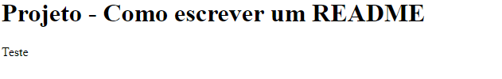

# Projeto - Como escrever um README file

Fizemos esse projeto para poder entender melhor como escrever um README

# Começando 
Com essas instruções permitirão que você obtenha README no seu projeto com operações na sua máquina local para afins de desenvolvimento e teste do seu projeto.

# Pre-requisitos 
